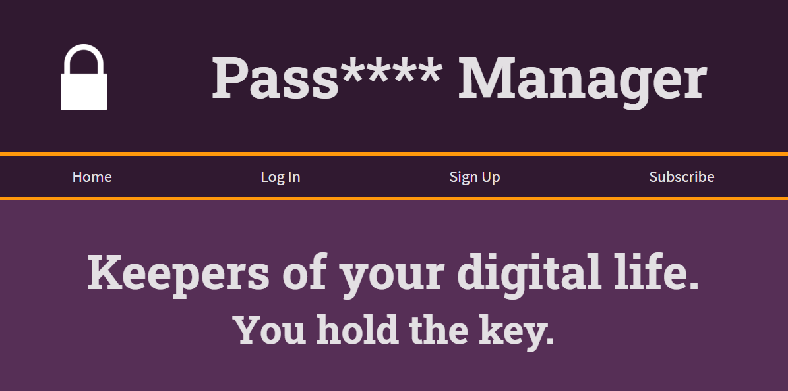
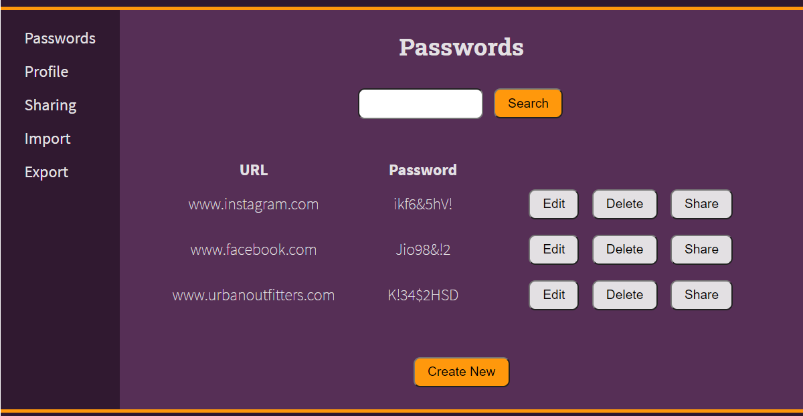

<!-- PROJECT SHIELDS -->
<!--
*** I'm using markdown "reference style" links for readability.
*** Reference links are enclosed in brackets [ ] instead of parentheses ( ).
*** See the bottom of this document for the declaration of the reference variables
*** for contributors-url, forks-url, etc. This is an optional, concise syntax you may use.
*** https://www.markdownguide.org/basic-syntax/#reference-style-links
-->

<!-- PROJECT LOGO -->
 

  

  <h3 align="center">Password Manager</h3>

  

    An app to help you manage your online passwords. In addition to managing your own passwords, this app allows you to share passwords with another user. 
     
     
    <a href="https://github.com/github_username/Group7_Codesses_PasswordManager">View Demo</a>
    ·
    <a href="https://github.com/github_username/Group7_Codesses_PasswordManager/issues">Report Bug</a>
    ·
    <a href="https://github.com/github_username/Group7_Codesses_PasswordManager/issues">Request Feature</a>
  

<!-- TABLE OF CONTENTS -->

  
<h2 style="display: inline-block">Table of Contents</h2>

  <ol>
    <li>
      <a href="#about-the-project">About The Project</a>
      <ul>
        <li><a href="#built-with">Built With</a></li>
      </ul>
    </li>
    <li><a href="#features">Features</a>
      <ul>
        <li><a href="#account">Account</a></li>
        <li><a href="#login">Login</a></li>
        <li><a href="#import-and-export">Import and Export</a></li>
        <li><a href="#sharing-password">Password Sharing</a></li>
        <li><a href="#passHint">Password Hints</a></li>
        <li><a href="#aboutUs">About Us</a></li>
        <li><a href="#faq">FAQ</a></li>
        <li><a href="#passwords">Passwords</a></li>
        <li><a href="#two-step-code">Two Step Code</a></li>
        <li><a href="#subscribe">Subscribe</a></li>
        <li><a href="#password-history">Password History</a></li>
        <li><a href="#two-step-question">Two Step Question</a></li>
      </ul>
    </li>
    <li><a href="#contributions">Contributions</a></li>
    <li><a href="#acknowledgements">Acknowledgements</a></li>
  </ol>

<!-- ABOUT THE PROJECT -->
## About The Project

 

    

 
This app was created as the group project for the <a href="https://humber.ca/course/web-application-development-2">HTTP5202 PHP</a> class of the <a href="https://mediaarts.humber.ca/programs/web-development.html">Web Development program</a> at <a href="https://humber.ca/">Humber College</a>. The goal is to showcase our knowledge of server-rendered, database-driven websites.

### Built With

* [PHP](https://www.php.net/)
* [MySql](https://www.mysql.com/)

<!-- FEATURES -->
## Features

### Account
Create an account to being using the app. The accounts are identified either by the unique primary key, available only to admins, or by user name, which is confirmed as unique before creating the account.

### Login
Once the account is created, the user is logged in. For subsequent logins, the user is required to enter their unique user name and password combination. Once logged in, the user has access to the other features.

### Import and Export

### Sharing Passwords
Logged in users are able to share password between other user accounts. The user is able to share multiple passwords with different users in the database or share to one account and update share url to the specfic user as needed.

### Password Hints
Users are able to set password hints to help with two step verification on their outside accounts if needed. This is an additional feature to the exsisting passwords or new password that are created.

### CRUD About Us (Admin side)
This is an admin side functinality to update static about us page. If the logged in user is admin they are able to add a staff member, update information or delete other staff members to give our clients an insight to our support staff.

### CRUD Contact Messages
This is a feature where admin can manage support messages that unregistered or registered users with an ID have sent. The admin can see all messages, update/create them, or delete any outdated messages.

### Login History
A logged in user can see their login history giving them the date, time, and action while showing their userID. Everytime a user logs in, this view is updated. Alternatively an admin can search all login hisotry from all users and see the same ifnormation based on user ID

### Search Passwords
A logged in user can search their passwords based on the URL. This makes it easier for users to find specific information among their various passwords.
### FAQ
The FAQ is accessible to any user who lands on the application whether they are logged in or not. When it comes to CRUD functionality, a user must be an admin in order to perform it. I need to add validation to this code as well which is something that will be done in the future.

### Passwords
A user must be logged in in order to see their saved passwords. They can CRUD any of their passwords including the url and their username. They can be linked to the password hints page as well if they would like to add, update or delete their password hints. They can also be linked to the share password page where the user can select a password they would like to share with another user. The password feature requires validation for some pages as well which is something that will be added in the future.

### Two Step Code
This page is the second option a user can choose if they have forgotten their password. They can choose this option to input an email and have an auto generated code sent to it. Once they have recieved the code, they can input it into the two step code page, which will redirect them to an update password page. Unfortunately, I have not been able to get around to creating an auto generated code to be able to send to the user in the email. This is something I would like to change in the future. It took me quite a while to program PHPmailer but it is now working after shutting off my antivirus. 

### Subscribe

Logged in users can access to read, delete, update and add a subscription. The user access a form with radio buttons to update and add a subscription and the options are special, monthly, and weekly. The list will allow the user to read his/her username, first name, last name, and frequency for the incoming mailing list.

### Password History

Logged in users can access and delete their personal password history. The user can see if a URL's password or URL's password hint has been updated, deleted, or added with the exact date and time.  

### Two Step Question

This feature is divided into two parts. The logged in user can read, delete, add and update a recovery question and recovery answer. The list will display the username, question, and answer associated with the account. The second part is when a user can not log in because they can't remember the password and the user's email will be provided to display their security question. The security answer should match to be redirected to the right page. I would like to completely update the password in the future, the SQL was already created in the model and works perfectly. However, I will be working on that in the future because updating a password is not only about SQL. it feels like another functionality to add because it is also about hashing, matching the two fields, and validating the password before is updated.

<!-- CONTRIBUTIONS -->
## Contributions

* Amanda
    * <a href="#faq">FAQ</a>
    * <a href="#passwords">Passwords</a>
    * <a href="#two-step-code">Two Step Code</a>
* Barb
    * <a href="#two-step-question">Two Step Question</a>
    * <a href="#password-history">Password History</a>
    * <a href="#subscribe">Subscribe</a>
* Elle
    * <a href="#CRUD-Contact-Messages">Contact Messages</a>
    * <a href="#Login-History">Login History</a>
    * <a href="#Search-Passwords">Search Password</a>
* Sandra
    * <a href="#account">Account</a>
    * <a href="#login">Login</a>
    * <a href="#import-and-export">Import and Export</a>
* Wafa
    * <a href="#sharing-password">Password Sharing</a>
    * <a href="#passHint">Password Hints</a>
    * <a href="#aboutUs">About Us</a>
    

<!-- CONTACT -->
## Contact

* Amanda - amanda.elias@live.ca
* Barb - cam.barbara@hotmail.com
* Elle - elea.roberts@hotmail.com
* Sandra - kupfer.sandra@gamil.com
* Wafa - wafamustafak@gmail.com

Project Link: [https://github.com/github_username/Group7_Codesses_PasswordManager](https://github.com/github_username/Group7_Codesses_PasswordManager)

<!-- ACKNOWLEDGEMENTS -->
## Acknowledgements

* [Nithya Thayananthan](nithya.thayananthan@humber.ca)
* [Best README Template](https://github.com/othneildrew/Best-README-Template)

